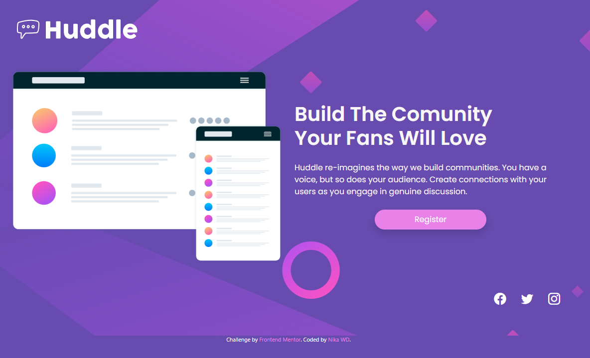
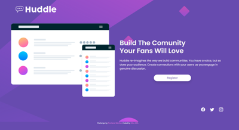

# Frontend Mentor - Huddle landing page with single introductory section solution

This is a solution to the [Huddle landing page with single introductory section challenge on Frontend Mentor](https://www.frontendmentor.io/challenges/huddle-landing-page-with-a-single-introductory-section-B_2Wvxgi0). 

## Table of contents

- [Overview](#overview)
  - [The challenge](#the-challenge)
  - [Screenshot](#screenshot)
  - [Links](#links)
- [My process](#my-process)
  - [Built with](#built-with)
  - [Notes](#notes)
- [Author](#author)

## Overview

### The challenge

Users should be able to:

- View the optimal layout for the page depending on their device's screen size
- See hover states for all interactive elements on the page

### Screenshot

### Links

- Solution URL: [Add solution URL here]()
- Live Site URL: [Add live site URL here]()

## My process

### Built with

- Bootstrap 5
- CSS
- HTML

### Notes

I wanted to try Bootstrap so I decided to solve this challenge with it. Not that I think this is the best option for this project, but definetely I'll keep using bootstrap for bigger projects. 
This is my first project with bootstrap but also my first project working alone (since I've just started to study web dev.), so feel free to make your comments and share your knowledge.

## Author

- Website - [NikaMiniva](https://github.com/NikaMiniva)
- Frontend Mentor - [@NikaMiniva](https://www.frontendmentor.io/profile/NikaMiniva)